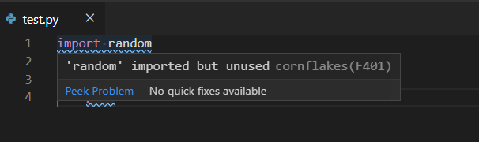

# Introduction

The following document should describe a default Python development environment. Which I created in relation to my needs, while working with Python. Feel free to suggest improvements and tips!

**Tested and written for Windows 10**

---


# Components

**Package Manager** 

Anaconda (https://www.anaconda.com)


**Editor**

Visual Studio Code (https://code.visualstudio.com)


**Linting check**

flake8 (https://flake8.pycqa.org/en/latest)


**Pre commit checks**

pre-commit (https://pre-commit.com)


# How to install and prepare it?

## Package manager  
* Download  the anaconda installer from the website (Python 3.x and / or python 2.x)
* Run the installer and select all defaults (optional PATH)


## Editor  
* Download  the vsc installer from the website
* Run the installer and select all defaults (optional PATH)


**Reboot your computer**


## Init Conda
Open cmd or PowerShell and run:
```
conda init
```
## Prepare VSC

* Press `Shift + Ctrl + P` and type `Terminal: Select Default Shell`
* Now select as Terminal `Command Promt`

## Linting Check

Install flake8 via conda

```
conda activate
conda install -c conda-forge flake8
pip install hacking pylint
```

Add to VSC the module cornflakes-linter
* Switch with ``Ctrl+Shift+X ``to the extension widnows, search for the module ``cornflakes-linter``  and press install.
* Open cmd and type ``where flake8`` to locate the executable and copy the path.
* Use Ctrl+, to open the settings and search for executablePath and paste the path from the previous command.
* Now linting with flake8 should be active, you can test it by open a py file and save it after writing some code.
* The output is shown in the ``PROBLEMS`` console and in the python code.



 


### Configure flake8  
You can configure flake8 per project through the file tox.ini, which should be in the root folder. This config will also effects parts of the flake8 pre-commit hook (exclude, ignore e.g.)!
A basic config can be found in teh file `files/examples/tox.ini` 

The main focus should be on ignore and exclude which offer the possibility to ignore error codes and exclude files from the check. But you can set also many other values, for more check out  https://flake8.pycqa.org/en/latest/user/options.html#options-list

The error code of flake8 are `E***`, `W***` used in pep8 and `F***` and `C9**`.
```
E***/W***: Error and warning of pep8
F***: Detection of PyFlakes
C9**: Detection of circulate complexity by McCabe
```
Error codes overview:  https://flake8.pycqa.org/en/latest/user/error-codes.html

## Pre commit check

Install it from anaconda
```
conda activate
conda install -c conda-forge pre-commit
```

(alternatively) Install it with pip
```
conda activate
pip install pre-commit
```

# How to use it?


**Checks** 

    [ ? ] Is anaconda already installed?  
    [ ? ] Is the correct anaconda version installed?  
    [ ? ] Are all steps freom the previous part done?  


**When to create a new environment?**

    [ Y ] Do you start a new project?  
    [ N ] Do you need a new environment in a project? 


## Steps

### create / checkout a  git repo
Create a new git repo

```
git init
git add FILES
git commit -m "MSG"
git remote add origin https://github.com/example/repo.git
git push -u origin master
```

Or add an existing one (be aware that there can be problems!)

```
git clone https://github.com/example/repo.git
```

### .gitignore
Create a .gitignore file, update yours or use the one from the example folder.

```
files/examples/.gitignore
```

## VS Code Workspace
In a Workspace can settings be definded, among others. These override user settings. Workspace settings are specific to a project and can be shared across developers on a project. You find more on https://code.visualstudio.com/docs/getstarted/settings

### Create a new workspace
Open VS Code and open the folder you created with ``File -> Open Folder....`` or press ``Ctrl + K Ctrl + O``
Alternativly you can right click in the checkout folder and select ``Open with code``. Save teh  Workspace in the folder with ``File -> Save workspace As...`` 

## Setup environment

### Create new Python environment
Creating a seperate python environment for every project or even for stages is very usefull. To do this follow these steps.

* open Anaconda Navigator or Anaconda prompt
    * switch to Environments and click ``Create`` at the bottom
    * Enter the name and select the Python version and create it

* Select the environment in your VSC
    * Press ``Shift + Ctrl + P`` and type ``Python: Select Interpreter``
    * Now select the python env you want to us

## Configure the environment

### Adding modules to your environment
Search them in the Anaconda Cloud (https://anaconda.org, maybe you need to add a channel)

Use the gui to install them (the complicate way 😉 )
*  Open the anaconda navigator and switch to Environments
*  Change the Environment for that you want to install the package and in the drop down from installed to All
*  Put into Search Packages the name of the package and click the checkbox
*  After you selected all packages, click Apply to install them and a second time to confirm the overall change


Use the cli to install them (the easy way 😉 )
* Open the anaconda prompt or the cmd
* Activate your environment with ``conda activate ENV_NAME``
* Type ``conda install -c CHANNEL PACKAGE`` to install the package

```
conda activate
conda install -c conda-forge pytesseract
```

### Configure pre-commit

To install and configure pre-commit, create / add the pre-commit configuration file ``.pre-commit-config.yaml`` to your project root.  Decide what you need from the pre commit hooks and remove if unneccessary ( these checks could slow down commits). Finally, install the pre-commit hooks with ``pre-commit install``.
These checks are executed when you enter ``git commit -m "comment"``. At the first execution, all hooks are downloaded and prepared, so it takes some time.


### Using the linting / flake8

Flake8 is integrated as linting checker and enhanced by the installed module ``cornflakes-linter``. 

```
Ignore a error code
Add them into the ``tox.ini`` behind ``ignore =`` and add a comment what and why this ignore.
```
```
Exclude files or directories
Add them into the ``tox.ini`` behind ``exclude =`` and add a comment what and why this ignore.
```

### Working with pre-commit
Pre-commit checks your code by upfront defined criteria before the commit is created.  Don't exclude checks or remove them, except there is good reason, these checks are usefull for the overall code quality! Checks that would modifie a file will allways fail the commit. You need to adopt these changes, add the file and run commit again.


# How to stay up2date?

## Package Manager
Anaconda Navigator checks on the startup if an update is available and ask you if you want to update

## Packages
The packages can be easily updated with the following commands.
**All envs**

    conda update --all  

**Spezific envs**

    conda update -n ENV --all


## Editor

Visual Studio Code has an automatic update function, alternatively you can open "Help -> Check for Updates"


## Pre-Commit

You can update your hooks to the latest version automatically by running `pre-commit autoupdate`. By default, this will bring the hooks to the latest tag on the master branch.


# FAQ / Know Error

## Pre-Commit fails with files were modified by this hook

This works as designed. If a hook modifies files then the commit itself was not ready. You can inspect whether the modifications were correct, re-add, and commit as usual. Modifications are treated as "failure" and let the intelligent end user perform the correct actions.


## conda activate throws error that your shell is not ready
You need to init conda the first time you run it.
```
conda init
```

## Disable telemtry 

If you don't wish to send usage data to Microsoft, you can set the telemetry.enableTelemetry user setting to false. VS Code lets you add features to the product by installing Microsoft and third-party extensions. These extensions may be collecting their own usage data and are not controlled by the telemetry.enableTelemetry setting.

```
File > Preferences > Settings, search for telemetry, and uncheck the Telemetry: Enable Telemetry
``` 


# Source

Among other things, these where some sources whcih have been used.


## VSC

https://code.visualstudio.com/docs  
https://code.visualstudio.com/docs/getstarted/telemetry  
https://code.visualstudio.com/docs/python/python-tutorial  
https://code.visualstudio.com/docs/python/linting  

## Anaconda in VSC

https://code.visualstudio.com/docs/python/environments  
https://code.visualstudio.com/docs/editor/integrated-terminal#_configuration  

## Anaconda

https://www.anaconda.com/keeping-anaconda-date/


## pre-commit

https://pre-commit.com/  
https://github.com/prettier/prettier

## Linting

https://flake8.pycqa.org/en/latest/user/configuration.html
